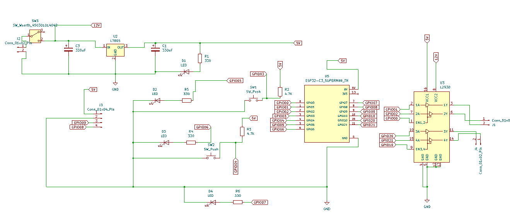

🤖 Self-Balancing Robot (ESP32 + MPU6050)

A two-wheeled self-balancing robot based on ESP32 and MPU6050 IMU, implementing PID control to stabilize an inverted pendulum system in real time.
The project focuses on practical control engineering, embedded systems, and electromechanical integration.

📌 Project Overview

This project demonstrates the design and implementation of a self-balancing robot using:

Real-time sensor fusion for tilt angle estimation

Closed-loop PID control for balance stabilization

PWM-based DC motor control

Embedded implementation on an ESP32 microcontroller

The robot is capable of maintaining an upright position and recovering from small disturbances.

🧩 System Architecture

Main subsystems:

Sensing: MPU6050 (accelerometer + gyroscope)

Control: PID controller running on ESP32

Actuation: Dual DC motors via motor driver

Power: Battery supply with onboard 5V regulation

🛠️ Hardware Components

ESP32 super mini 

MPU6050 IMU

DC  Motors (2×)

Motor Driver (L293D)

Custom prototyping boards

3D-printed mechanical frame

Battery pack with power switch

🔌 Electrical Schematic

The schematic below shows the complete electrical design including:

Power regulation stage

ESP32 GPIO connections

Motor driver interface

🧱 Mechanical Design & Assembly

🎯 Control Strategy
Angle Estimation

MPU6050 accelerometer and gyroscope data are combined to estimate the robot tilt angle.

Gyroscope data provides short-term accuracy, while accelerometer data corrects long-term drift.

PID Controller

The controller minimizes the tilt angle error using:

Proportional (P): Immediate correction based on angle error

Integral (I): Reduces steady-state error

Derivative (D): Improves damping and stability

Controller output is converted to PWM signals driving the motors.

💻 Software Architecture

Platform: Arduino framework (ESP32)

Main loop:

Read IMU data

Compute tilt angle

Apply PID control

Update motor PWM outputs

Modular structure for easy tuning and testing

📡 Features

Real-time balance stabilization

Adjustable PID parameters

Status indication using LEDs

Push-button interaction

Compact embedded implementation

🧪 Results & Observations

The robot can balance successfully for short to medium durations.

System stability is sensitive to:

PID tuning

Sensor noise and drift

Loop timing consistency

The project highlights real-world control challenges beyond simulation.

🚀 Future Improvements

Implement complementary or Kalman filtering

Add encoder feedback for velocity control

Improve mechanical rigidity

Implement auto-tuning or adaptive control

Wireless parameter tuning and monitoring

▶️ How to Run

Upload the firmware to the ESP32 using Arduino IDE

Power the robot on a flat surface

Tune PID parameters carefully

Gradually test balance recovery

⚠️ Start with low motor speed limits to avoid damage.

👤 Author

Mohamed Abdelrauf
Control & Automation Engineering
Self-Balancing Robot Project
